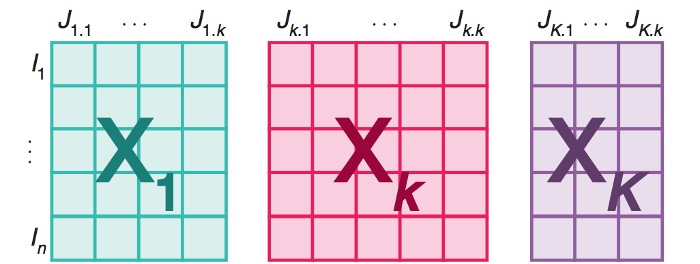
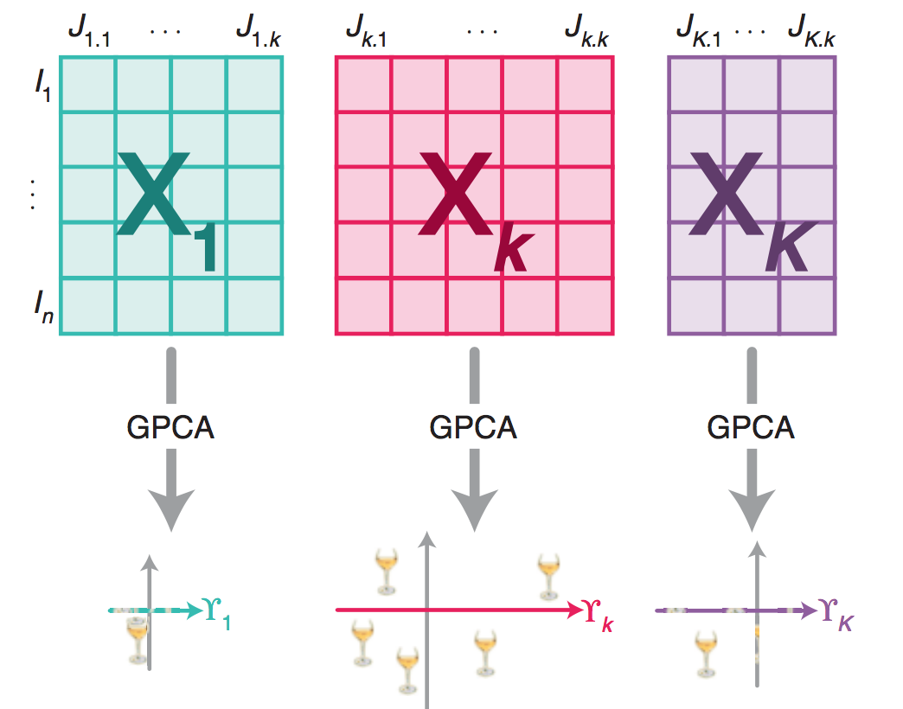
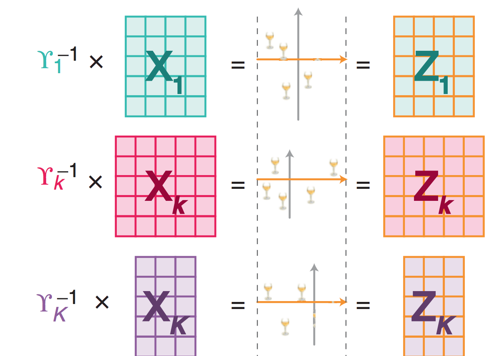
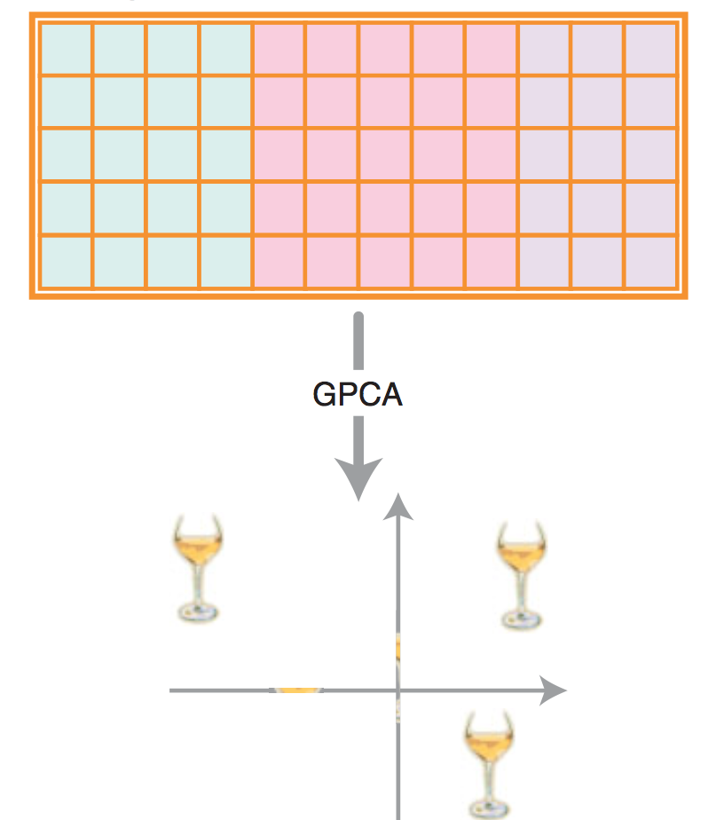
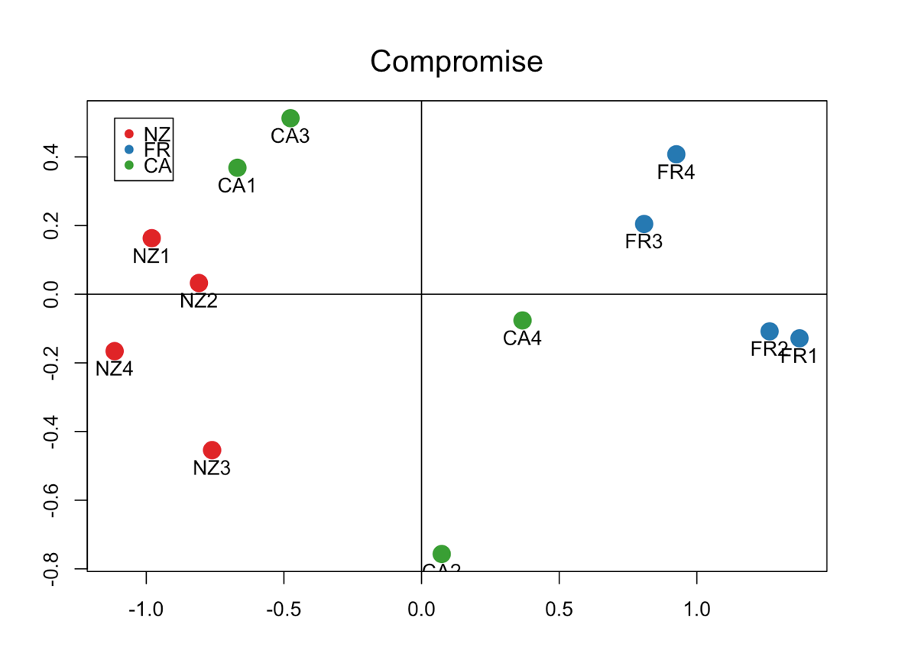
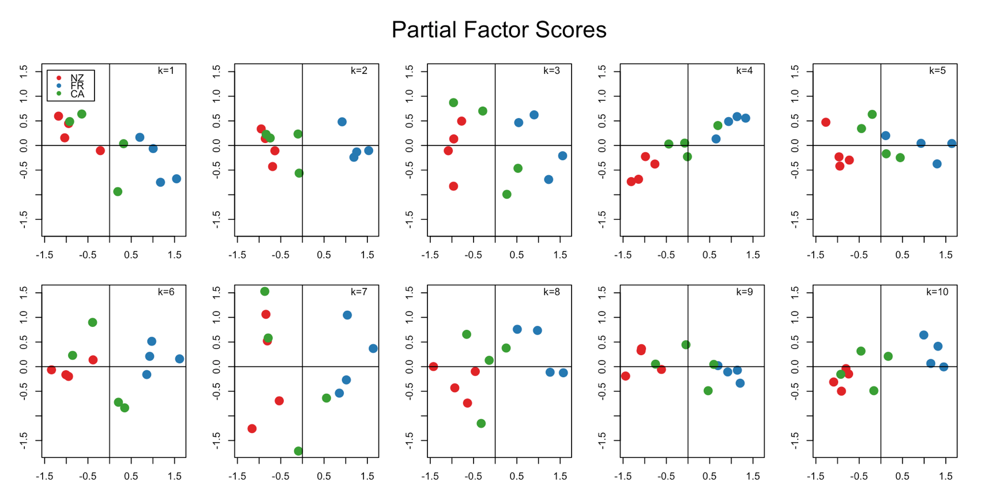
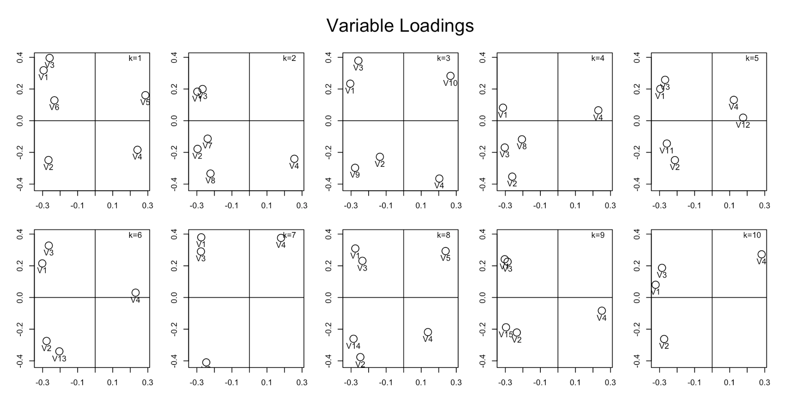

Multiple Factor Analysis in R
========================================================
author: Dario Cantore, Josiah Davis, Yanli Fan, Yoni Ackerman
date: 12/2/2016
autosize: false

What is Multiple Factor Analysis?
========================================================

"Multiple factor analysis (MFA, also called multiple factorial analysis) is an extension of principal component analysis (PCA) tailored to handle multiple data tables that measure sets of variables collected on the same observations, or, alternatively, (in dual-MFA) multiple data tables where the same variables are measured on different sets of observations. " - SOURCE

What is the Multiple Factor Analysis Algorithm?
========================================================
1. K tables of $J_k$ variables collected on the same observations
2. Compute generalized PCA on each of the K tables (where $\gamma$ is the first singular value of each table)
3. Normalize each table by dividing by its first singular value ($\gamma$)
4. Concatenate the K normalized tables
5. Compute a generalized PCA on the concatenated table

SOURCE

Step 1: K tables collected on the same observations
========================================================
- Tables can have different numbers of variables
- Each table is assumed to have the same number of rows





Step 2: Compute generalized SVD on each of the K tables
========================================================

$$
\mathbf{X = U D V^\mathsf{T}}
$$

- $U$ is the matrix of left singular vectors of 
- $D$ is the diagonal matrix of singular values
- $V$ is the matrix of right singular vectors



Step 3: Normalize each table by dividing by its first singular value
========================================================
- Placeholder
- Placeholder



Step 4: Concatenate the K normalized tables
========================================================
- Placeholder
- Placeholder


Step 5. Compute a generalized PCA on the concatenated table
========================================================
- Placeholder
- Placeholder




How to Use The MFA Package
========================================================
Getting started is easy. Just install the mfa package from github, and call mfa with your dataset and a list of variables.


```r
library(mfa)
mfa1 <- mfa(data, sets)
```


Read our [vignette](https://github.com/fussballball/stat243FinalProject) for detailed tutorials

Interpreting the Output
========================================================
Calling the plot function will give you summary charts to help you interpret your data.


```r
library(mfa)
mfa1 <- mfa(data, sets)
plot(mfa1)
```

Compromise Scores
========================================================

The Compromise Scores give an overall summary of the structure present in the data. 

 

For example: Notice how similar the New Zealand (NZ) Wines are to each other compared to the California (CA) Wines.

Partial Factor Scores
========================================================
The Partial Factor Scores provide a deeper understanding how the structure of the data varies by group.



For example: Notice how the California wines are generally in between the New Zealand and French Wines.

Variable Loadings
========================================================
Variable Loadings reveal the structure and relationship between different variables.



For example: Notice how V1 and V3 are usually close to each other, while V4 is further away, and often by itself.
